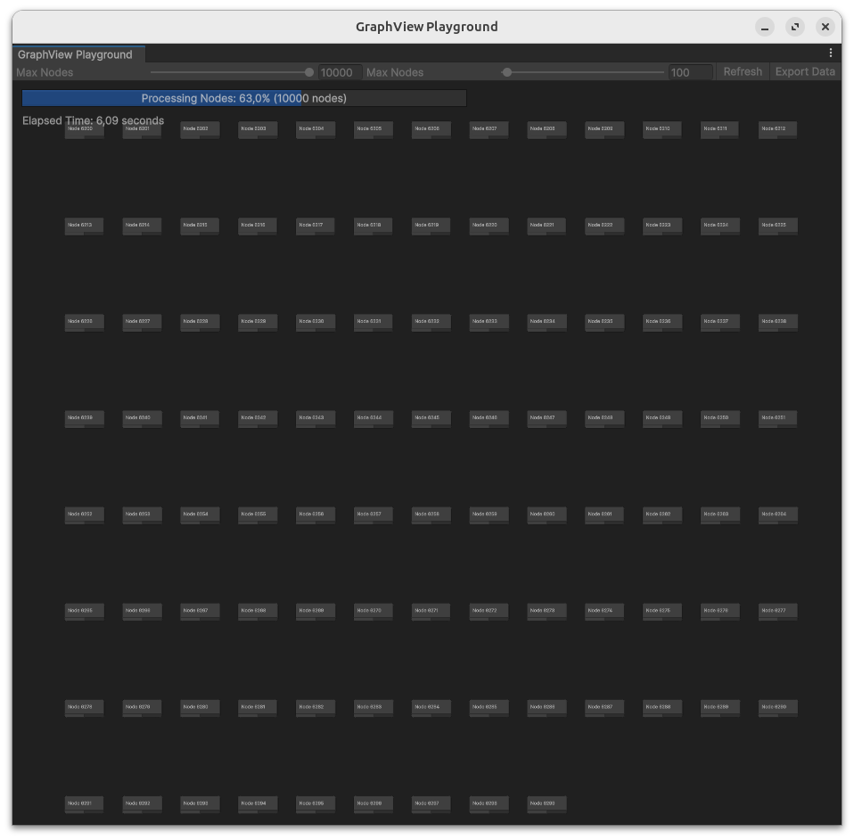
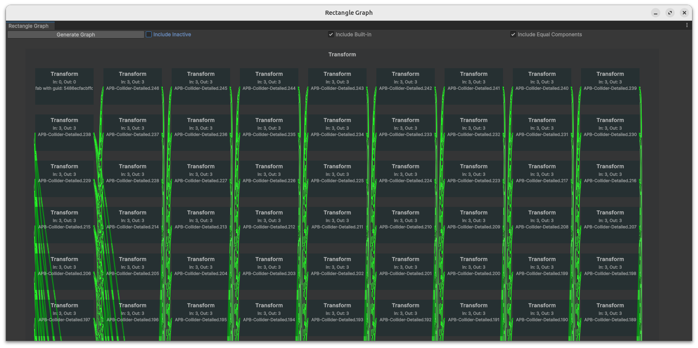
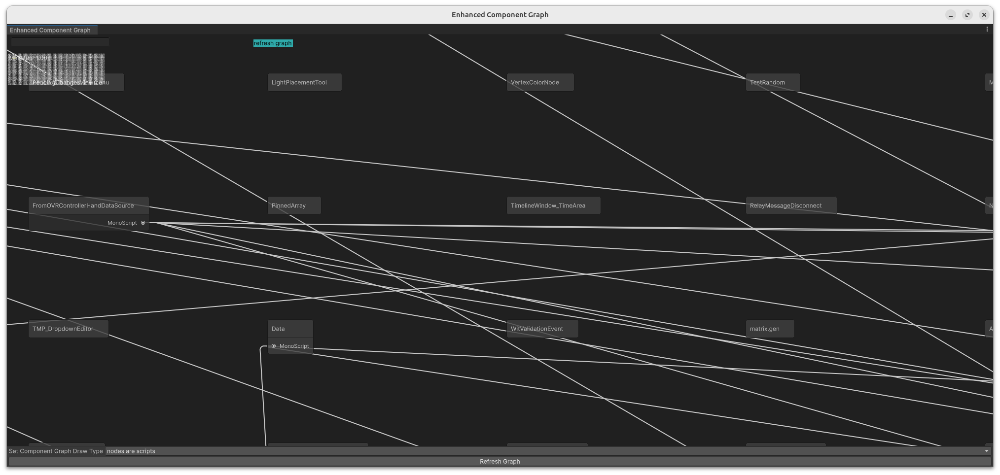

# SceneConnections
Unity plugin that helps to understand the current scene as well as the project as a whole

## Editors
In this project there are multiple revisions of the node overview editor
- GraphViewPlayground (performance measurement of Unities Graph View Api, basic node interactions)

- RectangleOverview (prototype of ComponentGraphView: per GameObject visualization of game objects and corresponding components)

- ComponentGraphView (combining different view modes for a Unity project)

## TODO

### General
- [x] Add documentation (1.11.2024)
- [x] Add script visualization to CreateGraph method (2.11.2024)
- [x] Try out/try to understand IXLAB example scene (2.11.2024)
- [ ] Add connectivity between nodes via drag and drop
- [x] Test performance of unity editor: nodes/edges (4./5.11.2024)

### Script visualization
- [x] ~~Performant script parsing using reflection~~ script parsing utilizing parallelism since no ui (2.11.2024)
- [x] Add useful parameters to the script nodes such as references to other classes (2.11.2024)
  - currently implemented without down tracking unrepresented dependencies
- [ ] Representation of results using UML like structure
  - ideas: utilizing WebView to draw nodes to avoid unity single threaded gui
  - use D3.js to benefit from graph drawing
  - using ECS
  - optimize node rendering with GPU instancing

### GameObject Visualization
- [x] Visualize GameObjects as Group that contains Components as Nodes (27.10.2024)
- [x] Visualize GameObjects as Nodes that have Components as their ports (27.10.2024)
- [ ] fix Node Layout within Groups 
  - [x] basic fix using grid (2.11.2024)
  - [ ] considering width of nodes
  - [ ] super advanced relying on connections force based

### Layout
- [x] General Layout method to layout Nodes after creation/delay if not possible (2.11.2024)

### Search functionality
- [x] reset nodes to be the correct color (1.11.2024)
- [ ] add checkboxes to search in more than just the title attribute

### Presentation
- [ ] prepare slides for results
  - diagrams showing how fast node creation can be
  - alternative mindmapping programs/uml like programs (D3.js/graphviz/…)
  - …