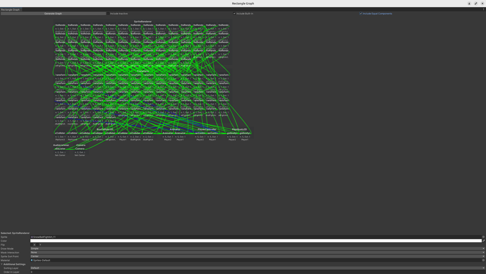
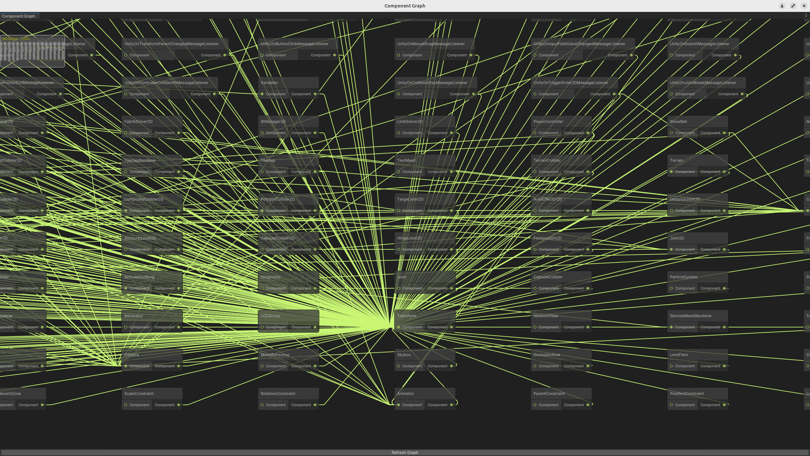
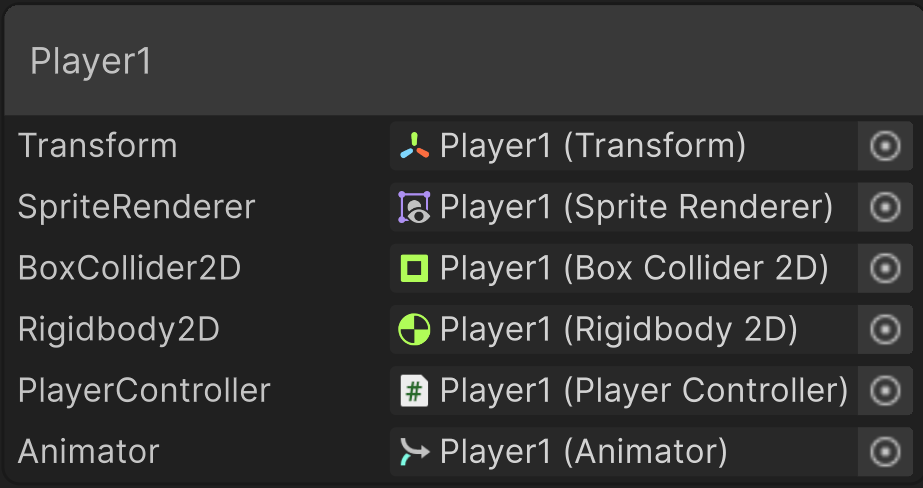
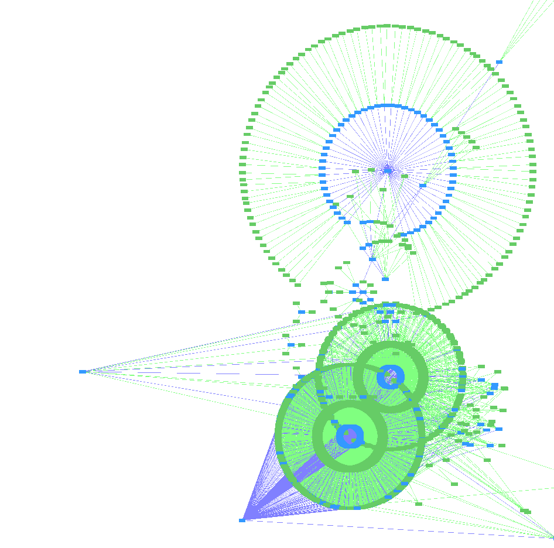
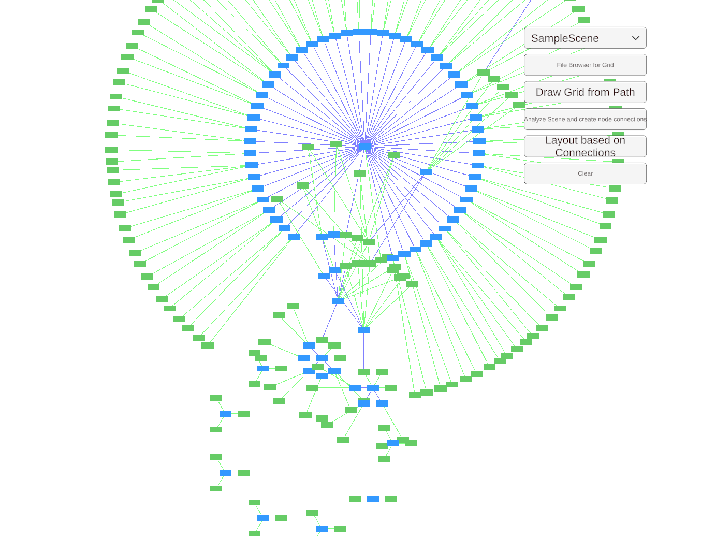

# UnityConnections

## Setup
Since I am only getting started with Unity, this section has still had a lot of steps to take by hand
1. `git clone https://github.com/FlorianMehnert/UnityConnections.git`
2. `git clone https://github.com/FlorianMehnert/3DConnections.git Assets/3DConnection`
3. open UnityConnections as a Unity project
4. download the unity package for the standalone file browser and import into unity Assets → Import Package → Custom Package
 
## If you want to use roslyn on linux:
5. install [NuGet](https://github.com/GlitchEnzo/NuGetForUnity?tab=readme-ov-file#how-do-i-install-nugetforunity)
6. in NuGet search for Microsoft.CodeAnalysis and Microsoft.CodeAnalysis.CSharp and install these packages (a version in this project is 4.12.0 for both. on linux, you might also need to install SQLitePCLRaw.bundle_green if workspaces fail to compile 

## Progress

- This project is only the test environment for all the contained modules, e.g. [SceneConnections](https://github.com/FlorianMehnert/SceneConnections) and its successor [3DConnections](https://github.com/FlorianMehnert/3DConnections/)
- SceneConnections focussed more on the structure of classes and inner dependencies, visualizing them using in separate Editor Windows using GraphViewApi which predefines relevant concepts such as nodes and their connections
- 3DConnections acts as an overlay to existing scenes meant to be dragged into existing Scenes to visualize at Runtime

### Scene Connections: [Rectangle Graph](https://github.com/FlorianMehnert/SceneConnections/blob/main/Editor/RectangleOverview.cs) 
- prototype of ComponentGraphView using rectangles instead of nodes which allowed for more extensibility
- generates a graph of class instances and connects them as they have references to each other
- selecting a rectangle in the editor pings the related game object which allows changing the related game object at runtime using the inspector
- performs layout using basic grids with fixed spacing since dimensions of nodes [can change at runtime](https://discussions.unity.com/t/how-can-i-properly-space-dynamically-loaded-nodes-in-graphview/875298) which forces the following implementations to register to the OnGeometryChanged event

### Scene Connections: [Component Graph](https://github.com/FlorianMehnert/SceneConnections/blob/main/Editor/ComponentGraphView.cs)
- reimplementation of class parsing/grid layout done in Rectangle Graph
- has additional features such as force directed layout, parsing of specific root folder
- uses the [experimental graph view api](https://docs.unity3d.com/ScriptReference/Experimental.GraphView.GraphView.html)
- minimap
  
- supports different modes: 
  - nodes are scripts (each node represents a file contained in the root folder specified in the given path)
  - nodes are components (nodes are contained in group objects that represent the game object while each node shows its current values)
  - nodes are gameobjects (each node represent )
  

### Evaluation of GraphViewApi
- most of the important ui update logic can only be performed on the main thread resulting in a slow UI 
- Node graphs with ~10,000 nodes take 40 seconds+ to be created with an average performance of 10 fps which is unpleasant to work with
- colored node connections (Line renderer instance) are not possible
- provides components such as minimap/searchbar out of the box
- node sizes are not available during creation
- integrates nicely into other editors
- still experimental
- perfect for smaller visualizations where 
- simple and easy to use allowing to focus on important tasks such as how to visualize node connections

### [3DConnections](https://github.com/FlorianMehnert/3DConnections/)
- requires 3DConnectionsEntrypoint Gameobject in the scene to analyze
- requires the scene to be in playmode to work
- can be toggled using F1
- allows positioning nodes using radial, tree and force-directed layout
- Toggle the start menu using Escape
- basic controller support

- radial layout iterating components and gameobjects of the given scene
- ping mechanism to highlight/change objects on select

## Current Goals
- improve selection behavior (select node whose center is closest to the cursor)
- add 3D-Overlay to view gameObjects and their connections during runtime
- for 2D add different strengths for component/parent-child connections
- add mobile controls